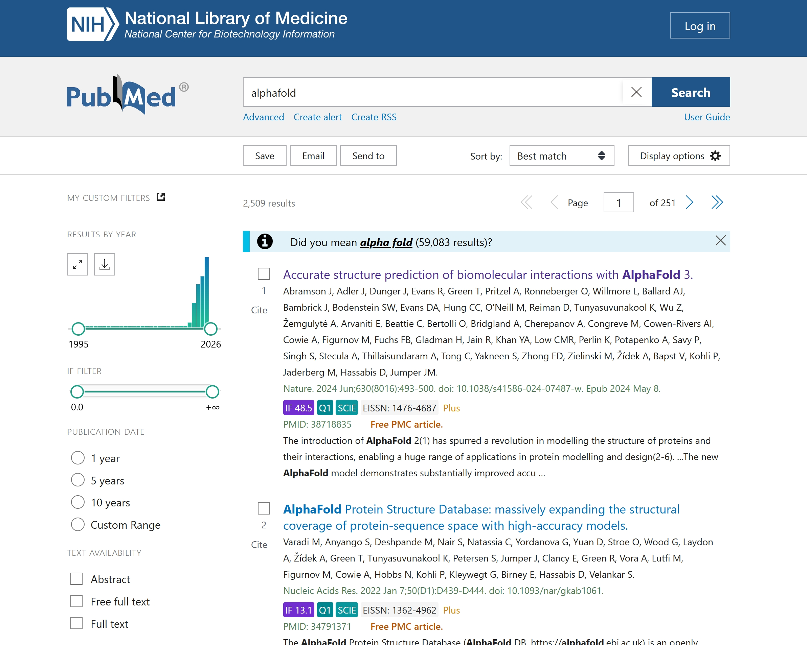
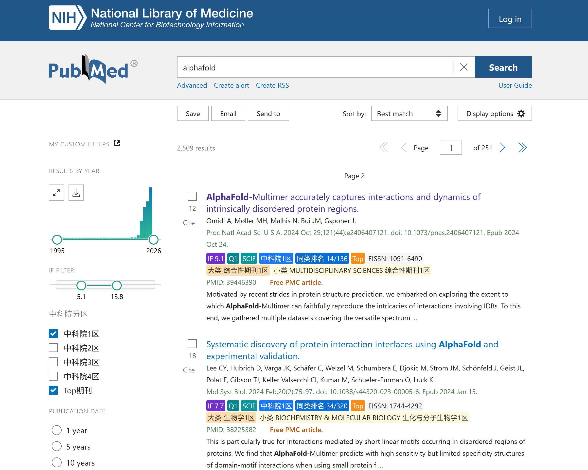
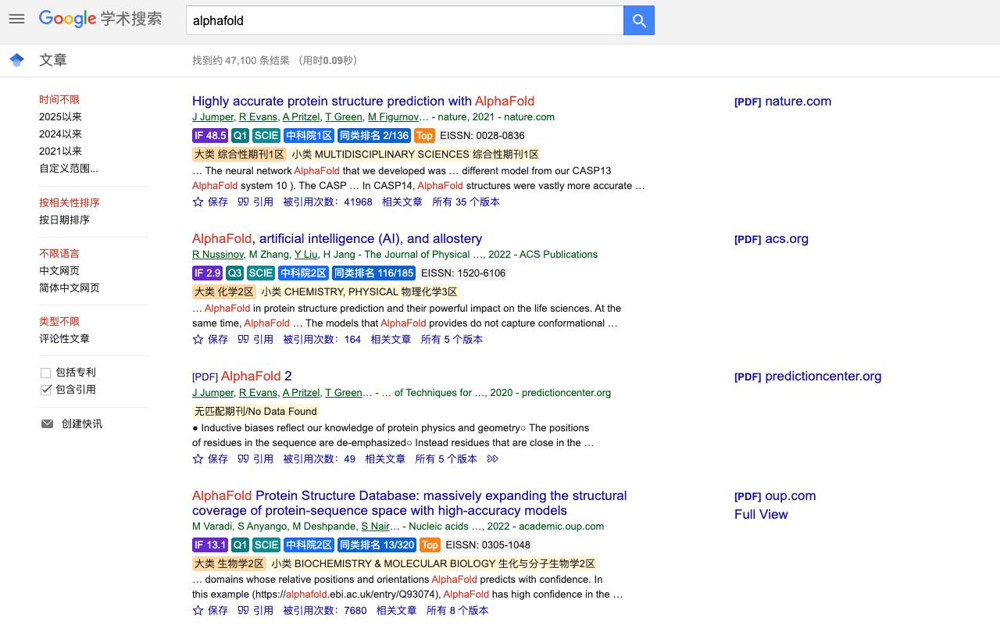

  

<h1 align="center">ScholarShip</h1>

  纯净的 PubMed & Google学术 增强浏览器扩展。
   
  无需注册、无需登录、没有多余的功能。
   
  <a href="https://scholarship.wenzhub.top/"><strong>访问 ScholarShip 主页»</strong></a>

---

## 🚀 功能一览

- **信息增强与筛选**：在 PubMed 和 Google Scholar 搜索结果页面提供额外的信息和筛选功能，体验如同原生。
- **2026.06 更新版本**：新增 Google 学术悬浮模式，支持在 Google Scholar 页面以悬浮卡片方式查看期刊信息。
- **数据刷新**：新增刷新数据按钮，可在扩展弹窗中手动拉取并更新最新数据。
- **数据版本**：已更新至 2026.06，包含 JCR2025，并同时保留中科院分区 2025 与中科院新锐分区 2026。
- **动态更新**：使用在线数据库与本地数据文件，确保信息时效性。
- **数据来源**：相关数据根据开源数据库计算，中科院相关数据仅对有授权的单位开放使用。

*免责声明：该扩展仅供学术研究参考，请遵守相关法律法规，在授权范围内使用。*

---

## 🛠️ 安装与使用

1.  **下载**: 下载压缩包后解压。（注意，该解压文件夹最好不要删除，否则可能导致插件故障）。
2.  **打开扩展管理**: 打开浏览器的扩展管理页面（例如，在 Chrome 地址栏输入 `chrome://extensions`）。
3.  **启用开发者模式**: 启用页面右上角的“开发者模式”。
4.  **加载扩展**: 点击“加载已解压的扩展程序”，然后选择第一步中解压出来的文件夹。
5.  **开始使用**: 访问 [PubMed](https://pubmed.ncbi.nlm.nih.gov/) 或 [Google学术](https://scholar.google.com/) 网站进行搜索，扩展将自动生效。
6.  **模式切换**: 在浏览器右上角的扩展程序图标处，可以切换增强/普通模式，并分别控制 PubMed 与 Google Scholar 是否启用插入；Google Scholar 支持插入模式与悬浮模式。
7.  **刷新数据**: 在扩展弹窗中点击刷新数据按钮，即可手动更新在线数据库内容。
8.  **PubMed 筛选**: 增强模式下可按 IF、中科院分区、中科院新锐分区进行筛选。

---

## 📸 应用截图

  
  
  

---

关注公众号，了解更多动态！

  

Contact us: scisail@126.com

